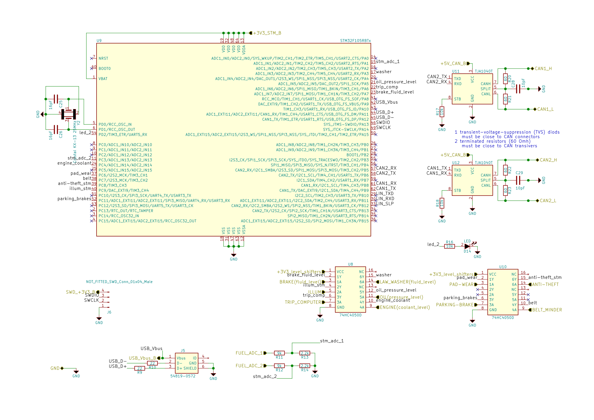
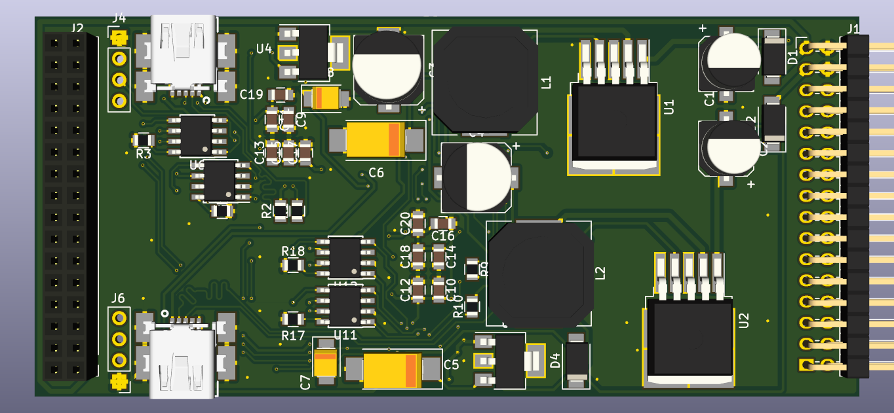
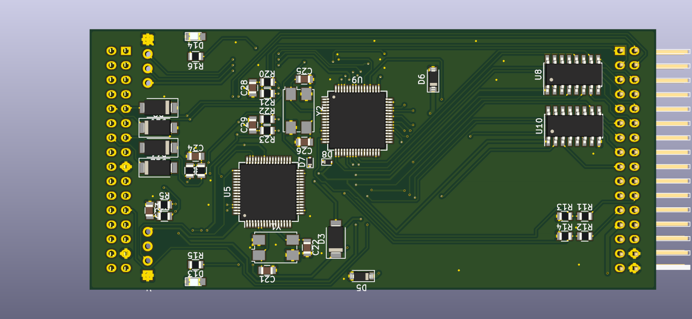

View this project on [CADLAB.io](https://cadlab.io/project/2495). 

# ECU emulator v3.1a
PCB part of project (source codes unavailable!)

## Scheme

## PCB

### With FreeCAD PCB mod

### With FreeCAD KiCAD StepUp mod

## Tools
- KiCAD v4.0.7
- FreeCAD v0.15
